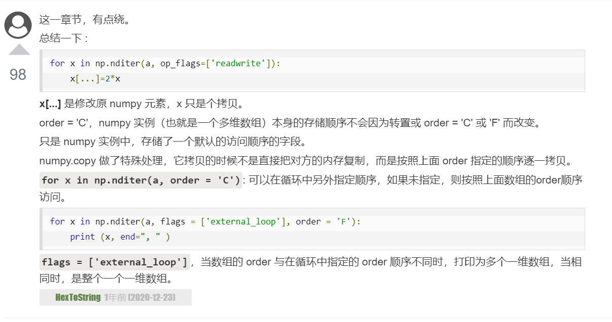

# NumPy

1. a.reshape() 返回的是非拷贝副本，即改变返回后数组的元素，原数组对应元素的值也会改变
2. **喜欢我ndarray吗?**np.dtype('name', 'i4'), 建立数组时候np.array(object, dtype = xxx)可以限定列的类型，并可以通过ndarray['key']的方式取出列

np.empty(shape, dtype); np.ones(); np.frombuffer(b'xxx', dtype); np.fromiter(iter, dtype)

np.arange(start, stop, step, dtype)

`生成数列`
np.linspace(start, stop, num=50, endpoint=True, retstep=False, dtype=None)
np.logspace(start, stop, num=50, endpoint=True, base=10.0, dtype=None)

`切片`
s = slice(start, stop, step); a[s]
多维情况 a[行slice, 列slice], a[..., 1]
`整数索引`
示例:获取矩阵四角元素
```[python]
import numpy as np 
 
x = np.array([[  0,  1,  2],[  3,  4,  5],[  6,  7,  8],[  9,  10,  11]])  
print ('我们的数组是：' )
print (x)
print ('\n')
rows = np.array([[0,0],[3,3]]) 
cols = np.array([[0,2],[0,2]]) 
y = x[rows,cols]  
print  ('这个数组的四个角元素是：')
print (y)

z = x[[0, 0, 3, 3], [0, 2, 0, 2]].reshape(2,2)
print(z)
```
即有x[[ [0, 0], [3, 3] ] , [ [0, 2], [0, 2] ]  ] == x[[0, 0, 3, 3], [0, 2, 0, 2]].reshape(2,2)


`过滤`
a[a > 5]; a[~np.isnan(a)]; a[np.iscomplex(a)]

`花式索引`
a[[1,3,2], ...]; a[..., [1,3,2]];
x[np.ix_([1,5,7,2],[0,3,1,2])]  会遍历行/列序号生成4*4矩阵

3. numpy和list类型的转换: 
   np.map(l); np.array(a);     a.tolist()

4. brocast规则: A+B == A+ np.tile(B, (4, 1))
5. **np.nditer**顺序 order = 'F'列优先; order = 'C'行优先; order = 'A'原顺序

b = a.copy(order = 'F')
for x in np.nditer(a, order = 'F'):
for x in np.nditer(a, op_flags=['readwrite']):

``` 示例:修改每个元素
import numpy as np
 
a = np.arange(0,60,5) 
a = a.reshape(3,4)  
print ('原始数组是：')
print (a)
print ('\n')
for x in np.nditer(a, op_flags=['readwrite']): 
    x[...]=2*x    # 注:这里的[...]很关键
print ('修改后的数组是：')
print (a)
```


``` 示例:输出各列list
for x in np.nditer(a, flags =  ['external_loop'], order =  'F'):  
   print (x, end=", " )
```

6. flags =  ['external_loop'] 在nditer的order与数组相同时顺序打印,反向时打印多个一维数组; 
7. x[...]是修改numpy的元素, 而x只是迭代器的拷贝

`数组操作`
np.reshape(arr, newshape, order='C') 或者 a.reshape
a.flat 返回迭代器;   a.flatten(order = 'A')返回一个展开的数组
np.transpose(a) == a.T == a.transpose()

8. 对a.flatten()修改不影响原数组, a.ravel()会影响

`广播`
numpy.broadcast_to(array, shape) 返回广播的结果数组
```
a = np.arange(4).reshape(1, 4)
np.broadcast_to(a, (4, 4))
```

numpy.squeeze(arr, axis) 删除一维的条目

`连接数组`
numpy.concatenate((a1, a2, ...), axis); axis默认为0
np.stack((*arr), axis); 
np.hstack((*arr), axis) 水平堆叠
np.vstack((*arr), axis) 垂直